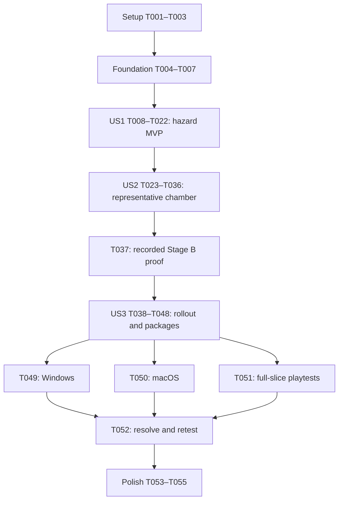

# Tasks: Recognizable Hazards and Gothic Atmosphere

**Input:** [spec.md](spec.md), [plan.md](plan.md), [research.md](research.md),
[data-model.md](data-model.md), [presentation contract](contracts/presentation.md) and
[quickstart.md](quickstart.md).

**Date:** 2026-10-09 | **Feature:** `002-improve-hazard-art` | **Git branch:** `main`

**Verification:** Tests and playable checks are explicitly requested by VR-001–VR-008.
Use existing regression infrastructure; add focused checks for the new presentation
contracts. Define expected results and observe failures for missing behavior before
implementing it. Automated success never substitutes for human or native-platform review.

**Organization:** Setup → foundation → US1 recognizable hazards (P1/MVP) → US2 chamber
atmosphere (P2/representative gate) → US3 six-room experience (P3) → final acceptance.
Implementation through T021 is complete. T022 human playable acceptance remains UNVERIFIED;
Phases 4–6 are outside the requested implementation scope. See [validation.md](validation.md).

## Format and execution rules

Every task has `- [ ] Tnnn`, optional `[P]`, a story label inside story phases, an action
and exact project-relative file paths. `[P]` means independent files within the stated
ready wave, after its prerequisites are complete. Shared manifest, runner and validation
record edits are serialized. Tasks use the exact versions, geometry, timing, controls,
budgets and review thresholds in the plan/contract; do not redesign mechanics to fit art.

`validation.md` records setup, expected/actual outcome, repeats, build/asset identity,
view/window/input/platform, logs/captures and defects. Unavailable checks remain UNVERIFIED
and their tasks unchecked. Fix observed acceptance defects and rerun affected checks;
never write a success stub or treat an absent test as a pass. Stated gates are evidence
gates, not additional approval requests. No commit, publication or paid purchase is required.

## Phase 1: Setup

**Purpose:** Establish the current baseline and durable source/evidence inputs. Existing
Godot project, controls, state owners and six rooms already exist; do not recreate them.

- [X] T001 Verify the pinned engine/tool versions and current settings in `.godot-version`, `project.godot` and `resources/gameplay_tuning.tres`; run the existing isolated full baseline through `scripts/checks/run_checks.py` and create `specs/002-improve-hazard-art/validation.md` with actual results and inherited human/native checks still unverified (VR-003, VR-008).
- [X] T002 Define evidence rows and reproducible arrangements in `specs/002-improve-hazard-art/validation.md`, `specs/002-improve-hazard-art/playtest.md` and `specs/002-improve-hazard-art/quickstart.md`: ten-trial cases, 60 recognition observations, 72 room/view/window combinations, four native input/platform runs and before/after performance captures; preserve the spec's thresholds (VR-002–VR-008).
- [X] T003 Obtain or locate the exact trial-selected free sources from `specs/002-improve-hazard-art/research.md`, verify archive hashes/free contents, and retain originals/licence evidence under `art/environment/kaykit_dungeon/`, `art/hazards/iron_anvil/` and `art/hazards/sawblade/`; preserve `art/.gdignore`, supplied root archives and unrelated working changes; record acquisition/source gaps in `specs/002-improve-hazard-art/validation.md` (FR-014–FR-017; VR-001; C6).

## Phase 2: Foundational prerequisites

**Purpose:** Shared provenance, materials and a safe test setting. Complete T001–T007
before story implementation. Runtime asset acceptance remains a story-level outcome.

- [X] T004 Create `assets/art/manifest.json` using the AssetRecord fields in `specs/002-improve-hazard-art/data-model.md`, initially for the three selected trap assets, with stable IDs, creator/source/free-edition/licence/archive identity, retained originals, planned runtime dependencies and trial status; represent unmeasured export fields explicitly until T016 populates them, add environment runtime records at T031, and retain the completed three-pack comparison reference (FR-014–FR-017; VR-001; C6).
- [X] T005 Prepare shared non-emissive trap metal and ink accent resources in `resources/materials/hazard_metal.tres` and `resources/materials/hazard_ink.tres`; define per-instance state styling without mutating shared base materials, retaining neon/amber/yellow for existing gameplay cues (FR-004, FR-008; C1).
- [X] T006 Scaffold `tests/scenes/art_validation.tscn`, `tests/scenes/art_room.tscn` and `tests/art_validation.gd` using actual production room/hazard/plate/door/cow components with isolated saves and all representative interactions; include fixture-only baseline/candidate and trap-name visibility controls, leave production defaults unadopted, and keep the fixture outside the progression catalogue (FR-018; VR-002, VR-005; C1, C7).
- [X] T007 Add the reusable development inventory utility `scripts/checks/art_inventory.gd` to report transformed bounds, evaluated runtime triangle/surface/material/texture counts and forbidden descendants for supplied visual roots; make missing dependencies fail explicitly and preserve existing strict process/error handling in `scripts/checks/import_check.gd` (VR-001, VR-007; C1, C6).

**Checkpoint:** Durable source records and the existing-component test launcher are ready.
No new presentation has been accepted or applied across the production sequence.

## Phase 3: User Story 1 — Recognize Traps and Their States (P1 / MVP)

**Goal:** Recognizable anvils, spikes and toothed wheels with truthful boundaries and
state cues, playable in the representative fixture.

**Independent test:** From all four normal camera views, approach exposed spikes, cross a
body-supported route, jam/release the wheel and watch an anvil cycle with sound muted.
Confirm collision/state invariants and ten fresh applicable interaction trials on keyboard
and controller. Formal five-reviewer scoring uses the finished chamber in US2.

### Verification first

- [X] T008 [P] [US1] Add `tests/physics/test_spike_art.gd` for all four authored bed sizes, unchanged support/lethal envelopes, shallow visual tips, bounded edge instances, corpse-covered routes and rejected placements; define ten-repeat expectations before spike art exists (FR-002, FR-006, FR-011; EC-01, EC-04; VR-003; C2).
- [X] T009 [P] [US1] Add `tests/physics/test_saw_art.gd` for local-X axle/radius/bounds, motion only while active, persistent/multi-body jam, final-contributor removal, held-body exclusion, immediate reactivation and independent state styling across two saws; repeat state transitions ten times (FR-003–FR-004, FR-006; EC-02–EC-03; VR-003; C3).
- [X] T010 [P] [US1] Add `tests/physics/test_anvil_art.gd` for square footprint, bottom pivot, owner-phase warning/descent/impact/return agreement, pause, skipped phase, restart/retirement, unchanged one-strike-per-cycle timing and corpse immunity; repeat ten cycles/setups (FR-001, FR-005–FR-006; EC-05, EC-07; VR-003; C4).
- [X] T011 [P] [US1] Add `tests/physics/test_art_assets.gd` using `scripts/checks/art_inventory.gd` for runtime dependency closure, provenance completeness at import acceptance, no generated collision/vendor scripts/cameras/lights in visual subtrees, and no registry/contact mutation by cosmetic changes (FR-011, FR-015–FR-017; EC-08; VR-001, VR-003; C1, C6).
- [X] T012 [US1] Verify discovery of T008–T011 in `tests/run_tests.gd`, extend `scripts/checks/import_check.gd` only where necessary to load candidate asset dependencies, and record expected failing case IDs for missing art in `specs/002-improve-hazard-art/validation.md`; preserve existing suites and strict nonempty/error-free success criteria (VR-003; C7).

### Models and implementation

- [X] T013 [P] [US1] Adapt the separate KayKit spike mesh from `floor_tile_big_spikes.gltf`, retain editable adaptation in `art/hazards/spikes/spikes.blend`, and export `assets/art/kaykit_dungeon/spike_cluster.glb` with `assets/art/kaykit_dungeon/SOURCE.md` and supplied licence; normalize shallow points for tips initially at Y=.16 without changing support geometry or claiming paid source files (FR-002, FR-015–FR-017; C2, C6).
- [X] T014 [P] [US1] Normalize the inspected `Iron Anvil.fbx` in `art/hazards/iron_anvil/anvil.blend`, export `assets/art/iron_anvil/anvil.glb`, and write `assets/art/iron_anvil/SOURCE.md` plus dated creator-page CC0 evidence; use a bottom-centered pivot and initial 1.8 m long axis within the 2×2 footprint, retaining a readable horn/waist/foot and shared metal treatment (FR-001, FR-015–FR-017; C4, C6).
- [X] T015 [P] [US1] Open the retained saw source with automatic execution disabled, repair its legacy material/texture references, preserve `art/hazards/sawblade/sawblade.blend`, and export `assets/art/sawblade/sawblade.glb` plus `assets/art/sawblade/SOURCE.md` and supplied readme; normalize a centered local-X axle, .85 m outer radius and thickness within the contract, retaining teeth and hub (FR-003, FR-015–FR-017; C3, C6).
- [X] T016 [US1] Populate exported file hashes, transformations, modifications and actual imported geometry/material/texture metrics in `assets/art/manifest.json`; run strict import/dependency/isolation checks via `scripts/checks/import_check.gd` and T011, resolve clean-conversion issues reported during research, and record source-to-runtime acceptance evidence in `specs/002-improve-hazard-art/validation.md` (VR-001; C6).
- [X] T017 [P] [US1] Implement `scenes/art/hazards/spikes_visual.tscn` and `scripts/art/spikes_visual.gd`, then add optional cosmetic assignment to `scripts/hazards/spike_bed.gd`; decouple visual sizing from BoxMesh, fit/repeat points and danger outline inside `bed_size`, and retain original shapes/root identity with no production-default adoption yet (FR-002, FR-006, FR-011; C1, C2).
- [X] T018 [P] [US1] Implement `scenes/art/hazards/saw_visual.tscn` and `scripts/art/saw_visual.gd`, then add optional cosmetic assignment to `scripts/hazards/buzzsaw.gd`; drive 9 rad/s local-X motion and persistent colour-independent jam cues from eligibility, mark the full rectangular danger corridor, and keep stopped traversal free of solids (FR-003–FR-004, FR-006, FR-011; C1, C3).
- [X] T019 [P] [US1] Implement `scenes/art/hazards/anvil_visual.tscn` and `scripts/art/anvil_visual.gd`, then add optional cosmetic assignment to `scripts/hazards/anvil.gd`; implement C4's phase-derived descent/impact/return and square warning, preserve the authoritative 1 s warning/3 s cycle, and avoid duplicate sounds, lethal callbacks or corpse impulses (FR-001, FR-005–FR-006, FR-011; C1, C4).
- [X] T020 [US1] Select the candidate trap scenes only in `tests/scenes/art_room.tscn` and `tests/art_validation.gd`, connect state/phase initialization and pause/retirement, and verify baseline/candidate comparison plus trap-name hiding for later review without changing production room defaults (FR-018; VR-002, VR-005; C1–C4).
- [X] T021 [US1] Run T008–T011 and the affected existing state/physics/recovery checks through `scripts/checks/run_checks.py`, fix hazard visual integration defects in the T017–T019 files, and record ten-trial results including death/carry/FIFO/placement/support and Stage A clean-import status in `specs/002-improve-hazard-art/validation.md` (VR-003, VR-008; SC-005; C7).
- [ ] T022 [US1] Perform the US1 independent playable test in `tests/scenes/art_validation.tscn` with keyboard/controller, four views, muted warnings and ten fresh applicable interactions; correct silhouette/boundary/state defects in `scenes/art/hazards/` and record setup/outcomes/captures in `specs/002-improve-hazard-art/validation.md` (US1/AS1–AS4; VR-002; SC-005).

**Checkpoint:** US1 is a useful hazard-art MVP in the fixture. It does not authorize
six-room art rollout; US2 completes the representative atmosphere/recognition gate.

## Phase 4: User Story 2 — Explore a Cohesive Gothic Testing Chamber (P2)

**Goal:** A coherent stone-and-iron testing chamber with readable controls, bodies and
hazards from every view, using the reused cow.

**Independent test:** Play one dressed chamber with all three traps and up to five
corpses; test 4 views × 3 window sizes, ten-trial interactions and character fit. Five
reviewers must meet SC-001/002/004. This story needs US1's ready traps, not six dressed rooms.

### Verification first

- [ ] T023 [P] [US2] Add `tests/physics/test_art_cutaways.gd` for nested cosmetic roots, initialization after the first view signal, all four diagonal views, separate opposite-side batches and persistent low trim; compare camera transforms, room snapshots and wall collision before/after view changes (FR-009, FR-011; EC-06; VR-003; C5).
- [ ] T024 [P] [US2] Add `tests/physics/test_chamber_art.gd` for 16×12/24×12 cosmetic fit, floor height within .005 m, trap-region exclusions, no decorative collision/support, preserved plate/door/hatch geometry/state cues and independent room material state (FR-007–FR-011; EC-05–EC-06; VR-003; C1, C5).
- [ ] T025 [US2] Confirm T023–T024 discovery in `tests/run_tests.gd` and expected failures against missing nested cutaways/chamber skins; record failing IDs and rendered cue review arrangements in `specs/002-improve-hazard-art/validation.md` and `specs/002-improve-hazard-art/quickstart.md` (VR-003–VR-005; C7).

### Environment and integration

- [ ] T026 [P] [US2] Curate the researched floor, wall, arch, pillar, doorway, closed-grate and sign-backing files into `assets/art/kaykit_dungeon/` with their required buffers/atlas; update `assets/art/kaykit_dungeon/SOURCE.md` with exact source members, free-edition evidence and adaptations, retaining available originals under `art/environment/kaykit_dungeon/` (FR-007, FR-014–FR-017; VR-001; C6).
- [ ] T027 [P] [US2] Define the candidate slate/ink palette in new `resources/materials/art_stone.tres` and `resources/materials/art_ink.tres`, using existing materials as read-only references, and simple background/ambient treatment in `resources/art/chamber_environment.tres`; retain one shadowed key light and contrast for neon/amber/yellow gameplay cues, with candidate resources selected only by the fixture until adoption (FR-008, FR-010; C5).
- [ ] T028 [US2] Build the candidate `scenes/art/gothic_chamber.tscn` and `scripts/art/chamber_dressing.gd` for both floor widths, aligned floor skins, bounded repeat batches, gothic trim and explicit per-side nested visual groups; exclude gameplay routes/danger markings and keep persistent low boundary trim, with no production dressing replacement yet (FR-007–FR-009, FR-011; C5).
- [ ] T029 [US2] Extend `scripts/rooms/room_camera_views.gd` and `scripts/art/chamber_dressing.gd` with registration/current-view application for nested cosmetic roots; hide only camera-facing visual groups, preserve internal gate cues, and keep existing camera, input and solid-wall behavior passing T023 (FR-009–FR-010; EC-06; C5).
- [ ] T030 [US2] Create `scenes/art/props/entrance_hatch.tscn`, `scenes/art/props/plate_skin.tscn`, `scenes/art/props/exit_skin.tscn` and `scenes/art/props/experiment_sign.tscn`; add optional cosmetic hookups in `scripts/puzzle/pressure_plate.gd` and `scripts/puzzle/exit_door.gd` where needed, retaining original labels, weights, opening/retreat geometry and persistent open-exit frame (FR-007, FR-010–FR-011; C1, C5).
- [ ] T031 [US2] Integrate the candidate chamber, skins and lighting only into `tests/scenes/art_room.tscn` and `tests/art_validation.gd`, maintain baseline/candidate comparison, and update `assets/art/manifest.json` with the curated environment dependency closure and measured inventory (FR-016, FR-018; VR-001–VR-002; C5, C6).
- [ ] T032 [US2] Run T023–T024, visual isolation and affected existing camera/placement/support/state checks using `scripts/checks/run_checks.py`; fix discovered chamber/cutaway integration defects and record results in `specs/002-improve-hazard-art/validation.md` (VR-003; SC-005).
- [ ] T033 [US2] Review the dressed fixture at 1280×720, 1920×1200 and 1024×768 in all four views with keyboard/controller and ten fresh physical trials; assess one live cow plus five corpses, poses/materials/support agreement, muted hazards and all required cues, correcting observed art/pose fit in `scenes/art/`, `assets/characters/cow/presentation.tres` and `scripts/player/character_visual.gd` as needed; record defects, fixes and affected retests in `specs/002-improve-hazard-art/validation.md` (US2/AS1–AS4; VR-002, VR-004; FR-010–FR-011, FR-018).
- [ ] T034 [US2] Add development-only rendered capture support in `tests/art_benchmark.gd` and `tests/scenes/art_benchmark.tscn` for matched baseline/candidate scenes, recording actual viewport/build/hardware, frame/physics samples and render inventory; require a real renderer for performance results and document its launch/capture command in `specs/002-improve-hazard-art/quickstart.md` (VR-007).
- [ ] T035 [US2] Measure the populated representative chamber with `tests/scenes/art_benchmark.tscn` at 1920×1080, 30 s warmup and 120 s capture; compare before/after counts/timing, optimize density/batches/materials within the plan's budgets, and record measured results or unverified hardware outcomes in `specs/002-improve-hazard-art/validation.md`; justify any revised allocation in `specs/002-improve-hazard-art/plan.md` before acceptance (VR-007; SC-006).
- [ ] T036 [US2] Run the five-reviewer 60-observation recognition test and muted state/footprint review, then five-minute atmosphere sessions using `tests/art_validation.gd`; require ≥54/60 and ≥18/20 per hazard, all reviewers correct on warning/jam/safe routes in every view, and ≥4/5 reviewers rating coherence ≥4/5 and describing the intended setting; resolve failures and record observations/retests in `specs/002-improve-hazard-art/playtest.md` (VR-005; SC-001–SC-002, SC-004).
- [ ] T037 [US2] Audit Stage B evidence from T032–T036 in `specs/002-improve-hazard-art/validation.md`, close applicable outstanding representative character/interaction/readability defects, and mark accepted trial assets/measurements in `assets/art/manifest.json`; keep the rollout gate unverified and this task unchecked if required playable, reviewer or budget evidence is missing (FR-018; VR-002, VR-005, VR-007–VR-008).

**Checkpoint / hard rollout dependency:** T037 must pass before any production-default
switch or room dressing rollout. Native full-sequence evidence is completed under US3.
Independent preparation may continue when a human gate is unverified; it does not count
as permission or evidence to bypass that gate.

## Phase 5: User Story 3 — Solve the Polished Six-Room Sequence (P3)

**Goal:** Accepted artwork in all six rooms with dependable solutions, input and recovery.

**Independent test:** Start each dressed room fresh, complete its existing intended
solution ten times under regression conditions, and exercise fresh/restarted/resumed
flows. Then check all 72 view/window cases and four native input/platform combinations.

### Verification first (after T037)

- [ ] T038 [P] [US3] Add `tests/physics/test_art_rollout.gd` and `tests/recovery/test_art_recovery.gd` for accepted art on every production hazard/room, exact authored bounds, fresh visuals after restart/transition/reopen, warning/drop/jam/death/held-oldest resets and no stale callbacks; repeat affected lifecycle scenarios ten times using actual production rooms (FR-012–FR-013; EC-07; VR-003, VR-006; C1, C7).
- [ ] T039 [P] [US3] Extend `scripts/checks/package_probe.gd` and `scripts/checks/check_package.py` to verify accepted production visual roots, imported mesh/texture dependency availability, exact spike-size overrides and distributed licence/credit files in compiled packages, while excluding source art/test scenes (FR-015; VR-001, VR-006; C6).
- [ ] T040 [US3] Verify discovery of the new rollout/recovery cases in `tests/run_tests.gd`, observe expected failures for unadopted production artwork, and record failing IDs in `specs/002-improve-hazard-art/validation.md`; retain all existing authored solution/bypass and recovery checks (VR-003, VR-006; C7).

### Rollout and validation

- [ ] T041 [US3] After T037, adopt accepted visual defaults in `scenes/hazards/spike_bed.tscn`, `scenes/hazards/buzzsaw.tscn` and `scenes/hazards/anvil.tscn`, expose the accepted chamber via `scenes/art/room_dressing.tscn`, and adopt optional puzzle skins in `scenes/puzzle/pressure_plate.tscn` and `scenes/puzzle/exit_door.tscn`; preserve root identities, labels, shapes and owner state (FR-012–FR-013; C1–C5).
- [ ] T042 [P] [US3] Fit accepted dressing, safe hatch and experiment signage to `scenes/rooms/room_01.tscn`, `scenes/rooms/room_02.tscn` and `scenes/rooms/room_03.tscn`, adapting only cosmetic transforms/exclusions for their actual authored dimensions and hazards; preserve teaching/solutions and all four camera views (FR-007–FR-012; VR-004).
- [ ] T043 [P] [US3] Fit accepted dressing, hatches, signs and internal-gate garnish to `scenes/rooms/room_04.tscn`, `scenes/rooms/room_05.tscn` and `scenes/rooms/room_06.tscn`, including wide footprints, offset passages, large spike beds and multiple interacting cues; preserve their existing five-body allocations (FR-007–FR-012; VR-004).
- [ ] T044 [US3] Run the complete strict regression suite via `scripts/checks/run_checks.py`, including ten fresh intended solutions for each room and existing bypass, jump/support, FIFO, contact, carrying and recovery cases; record exact new-build results and solution references in `specs/002-improve-hazard-art/validation.md`, correcting artwork-induced failures before proceeding (VR-003, VR-006; SC-005).
- [ ] T045 [US3] Execute and record all 72 room/view/window reviews in `specs/002-improve-hazard-art/validation.md`, covering fresh/five-body states, effects, muted hazards, internal gates, floor boundaries and every required cue; correct occlusion or danger-interpretation defects in the affected `scenes/rooms/room_01.tscn` through `scenes/rooms/room_06.tscn` or shared art and rerun affected checks (VR-004; SC-003).
- [ ] T046 [US3] Play the connected main flow from `scenes/main.tscn` with keyboard/controller, independently mute settings, restart during each active presentation state, reopen saved progress, complete Room 6 and replay; record expected/actual state and presentation in `specs/002-improve-hazard-art/validation.md` and fix any regressions in the owning visual integration files (US3/AS2–AS4; VR-003, VR-006).
- [ ] T047 [US3] Identify and profile the densest dressed room plus representative fixture with `tests/scenes/art_benchmark.tscn`; reduce decorative density/material/batch costs while preserving readability and opposite-side cutaways, update measured inventory in `assets/art/manifest.json`, and record captures/affected retests in `specs/002-improve-hazard-art/validation.md` (VR-007; SC-006).
- [ ] T048 [US3] Include required provenance/licence/credit files via `export_presets.cfg` and `scripts/checks/export_fixture.py`, obtain matching templates if needed, export the six-room production builds and run T039 package checks; record artifact hashes, compiled geometry/dependency results and pending native status in `specs/002-improve-hazard-art/release.md` (VR-001, VR-006; SC-007; C6).
- [ ] T049 [P] [US3] Validate the T048 Windows build with keyboard and physical controller through every room/menu/settings/restart/resume/completion/replay flow, and measure representative/densest-room performance on the Windows target class; record build/device/OS and actual outcomes in `specs/002-improve-hazard-art/evidence/windows.md`, leaving unavailable cases unverified (VR-006–VR-007; SC-006).
- [ ] T050 [P] [US3] Validate the T048 macOS build with keyboard and physical controller through every room/menu/settings/restart/resume/completion/replay flow, and measure representative/densest-room performance on the M1/8 GiB target class; record build/device/OS and actual outcomes in `specs/002-improve-hazard-art/evidence/macos.md`, leaving unavailable cases unverified (VR-006–VR-007; SC-006).
- [ ] T051 [US3] Record five first-time full-sequence sessions in `specs/002-improve-hazard-art/playtest.md`, identifying any previous representative-chamber exposure and measuring completion time against 20–30 minutes, help requests, misunderstood rules, jump judgment and placement frustration; turn presentation findings into concrete defects/retests without silently changing puzzle scope (VR-005, VR-008).
- [ ] T052 [US3] Resolve acceptance defects from T045–T051 in the affected `scenes/art/`, `scripts/art/` and room integration files, rerun only affected regressions/reviews after changes, refresh exports and repeat impacted native checks for changed builds; consolidate links to current evidence/build identities in `specs/002-improve-hazard-art/validation.md` and `specs/002-improve-hazard-art/release.md` (VR-003–VR-008; SC-003–SC-006).

**Checkpoint:** All six rooms use the accepted artwork. US3 completion requires actual
passing native/review outcomes; package-only or headless success is insufficient.

## Phase 6: Polish and cross-cutting acceptance

- [ ] T053 Audit `assets/art/manifest.json`, per-pack `SOURCE.md`/licence records and `specs/002-improve-hazard-art/release.md` against shipped files; ensure every adopted asset is supported by accepted evidence and every custom adaptation has a recorded reuse-gap rationale, removing unused trial runtime assets without deleting retained originals or user-supplied archives (FR-014–FR-017; VR-001; SC-007).
- [ ] T054 Update `specs/002-improve-hazard-art/quickstart.md`, `specs/002-improve-hazard-art/plan.md` and `specs/002-improve-hazard-art/validation.md` with actual final commands, selected values, results and limitations; cross-reference new evidence from `specs/001-six-room-slice/validation.md` where appropriate without rewriting historical outcomes or marking unrelated unrun gates passed (VR-008).
- [ ] T055 Audit all FR-001–FR-018, VR-001–VR-008 and SC-001–SC-007 against current evidence in `specs/002-improve-hazard-art/validation.md`, verify the completed tasks in `specs/002-improve-hazard-art/tasks.md`, and report remaining defects/unverified cases explicitly; mark overall artwork acceptance only when required outcomes pass (C7; VR-008).

## Dependencies and execution order

### Exact ready waves

Unlisted adjacent tasks run sequentially; a phase cannot start before its preceding
checkpoint. Cross-story parallel work is limited to non-adopting preparation and must
not bypass T037. Shared evidence/manifest writes stay serialized.

| Ready after | Tasks that can run together | Join / next dependent action |
| --- | --- | --- |
| T007 | T008, T009, T010, T011 | T012 records observed failures. |
| T012 | T013, T014, T015 | T016 consolidates import/provenance. |
| T016 | T017, T018, T019 | T020 integrates fixture. |
| T022 | T023, T024 | T025 records expected failures. |
| T025 | T026, T027 | T028 consumes assets/materials. |
| T037 | T038, T039 | T040 verifies the adoption checks. |
| T041 | T042, T043 | T044 checks the whole sequence. |
| T048 | T049, T050 | T052 waits for their outcomes and T051. |

T033 needs T032; T035 needs the capture support T034; T036 uses the reviewed/optimized
fixture from T033–T035; T037 consumes all representative outcomes. Native performance
uses the exported build from T048. Failed reviews can require repeating earlier asset,
visual or profiling tasks; after a changed build repeat impacted evidence, not unchanged
checks without cause. Record attempts without checking off a task whose criteria failed.

## Parallel examples per story

- **US1:** After T012, one worker adapts spikes (T013), another the anvil (T014), and another
  the saw (T015). They edit distinct source/runtime folders. T016 alone updates the manifest.
  After T016, the three hazard wrappers/owners T017–T019 are also independent.
- **US2:** After T022, write nested-cutaway expectations (T023) and chamber-fit/isolation
  expectations (T024) in separate test files. After T025, curate environment files (T026)
  while preparing palette/environment resources (T027). Integrate after both finish.
- **US3:** After T041, dress Rooms 1–3 (T042) and Rooms 4–6 (T043) separately; shared wrapper
  changes must be coordinated. After T048, Windows and macOS validation T049/T050 record
  separate files and can proceed together.

## Requirement, contract and entity coverage

| Scope | Tasks |
| --- | --- |
| FR-001–FR-006; hazard recognition/state/boundaries | T008–T022, T036, T041, T044–T045 |
| FR-007–FR-010; atmosphere/views/cues | T023–T036, T042–T045 |
| FR-011–FR-013; support/state/rollout/recovery | T008–T012, T021–T024, T029–T033, T038–T052 |
| FR-014–FR-017; reuse/provenance/adaptation | T003–T004, T011, T013–T016, T026, T031, T037, T048, T053 |
| FR-018; proof before rollout | T006, T020–T022, T031–T037; mandatory T037 → T041–T043 |
| VR-001; sourcing | T003–T004, T011, T013–T016, T026, T031, T048, T053 |
| VR-002; representative physics/character | T006, T020–T022, T031–T033, T037 |
| VR-003; regression | T001, T008–T012, T021, T023–T025, T032, T038–T040, T044, T046, T052 |
| VR-004; 72 rendered combinations | T002, T033 (fixture subset), T045 (all 72) |
| VR-005; player recognition/atmosphere | T002, T006, T036, T051 |
| VR-006; solutions/flows/native platforms | T038–T052 |
| VR-007; rendering budgets and benchmarks | T007, T016, T034–T035, T047, T049–T050 |
| VR-008; evidence and defect closure | T001–T002, all validation tasks, T052–T055 |
| SC-001/SC-002/SC-004 | T036, T037 |
| SC-003/SC-005 | T021–T022, T032–T033, T044–T045, T052 |
| SC-006/SC-007 | T035, T047–T050, T052–T055 |
| C1/C6; isolation/adoption/provenance | T003–T007, T011–T016, T020–T021, T031, T037, T039, T048, T053 |
| C2/C3/C4; spike/saw/anvil contract tests | T008/T009/T010 before T017/T018/T019 respectively |
| C5; chamber/camera contract tests | T023–T025 before T028–T031 |
| C7; review and regressions | T002, T012, T021–T022, T032–T037, T040, T044–T055 |
| AssetRecord | T004, T011, T016, T026, T031, T037, T053 |
| HazardVisualDefinition / HazardPresentationState | T008–T010, T013–T020, T038 |
| ChamberArtDefinition | T023–T031, T041–T043 |
| ValidationCase / Observation | T001–T002, T022, T033–T037, T044–T055 |

## Implementation strategy

1. **MVP first:** Finish Setup/Foundation and US1 through T022. Demonstrate recognizable
   traps and their real interactions in one playable fixture; no complete chamber sequence
   is needed for this increment.
2. **Atmosphere increment:** Add US2 to the same fixture, measure actual fit/budgets, and
   complete the five-reviewer proof. Preserve all three hazards' passing behavior.
3. **Controlled adoption:** Only after T037, change shared production defaults and dress
   the six rooms. Reuse existing layout/solutions and validate every occurrence/view.
4. **Complete acceptance:** Export, test native flows/performance, resolve playtest defects
   and finish provenance/evidence audits. If hardware/reviewers are unavailable, report
   unverified tasks and continue independent authorized work where its dependencies allow.

## Generation validation

55 tasks: Setup 3, Foundation 4, US1 15, US2 15, US3 15, Polish 3.
Twenty tasks are marked `[P]` across eight explicit ready waves. Every task has a sequential
ID, checkbox and file path; all story tasks have the correct story label. Coverage above
accounts for all requirements, verification requests, contracts and logical entities.
No extension configuration exists, so before/after task-generation hooks are skipped.
Tasks are checked only when supported by implementation evidence in validation.md.
